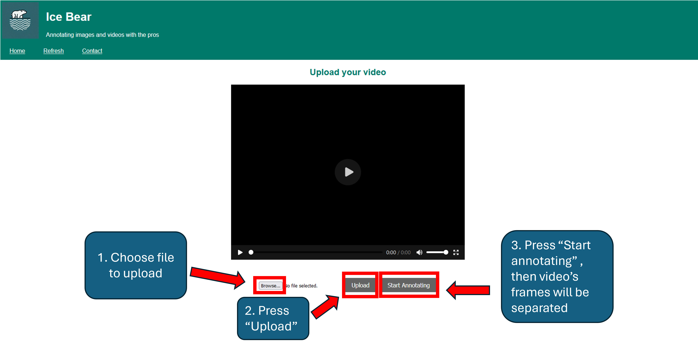
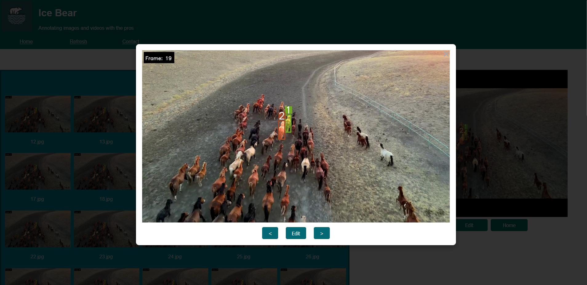
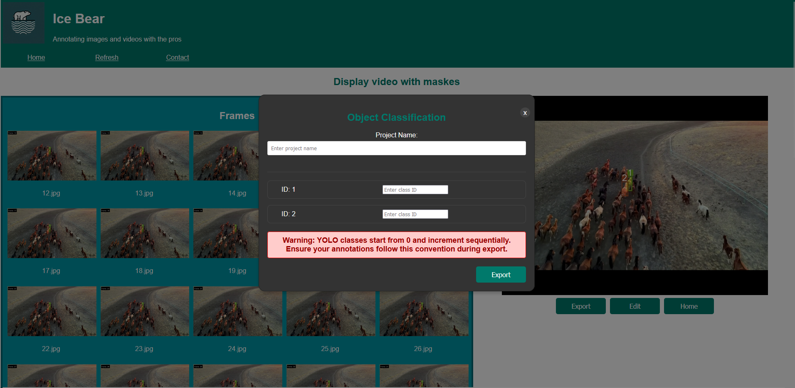

# 🚀 Instruction 🚀

## 🎞️ Uploading Video ->  

## 🔍 Selecting Frame from seperated frames from video

## 📝 Select the detected objects by placing a pointer on them 

## 🛠️ Review the generated masks and Propagate the masks through the video

## ✅ Verify they meet your expectations -> If one or more labeled frames are incorrect, select a frame to edit the mask ->

## 📤 Export the results in YOLO training dataset format. 

